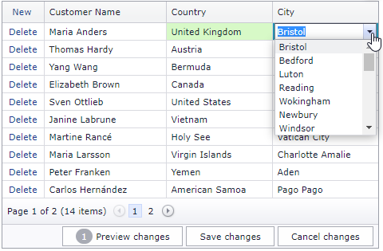

# Grid View for ASP.Net Web Forms - Cascading Combo Boxes in Batch Edit Mode
<!-- run online -->
**[[Run Online]](https://codecentral.devexpress.com/t124512/)**
<!-- run online end -->

This example demonstrates how to implement cascading combo box editors within [ASPxGridView](https://docs.devexpress.com/AspNet/DevExpress.Web.ASPxGridView).



## Setup the Grid and its Column Editors

Create an [ASPxGridView](https://docs.devexpress.com/AspNet/DevExpress.Web.ASPxGridView) control, set the grid's [edit mode](https://docs.devexpress.com/AspNet/DevExpress.Web.ASPxGridViewEditingSettings.Mode) to `Batch`, and add two columns of the [GridViewDataComboBoxColumn](https://docs.devexpress.com/AspNet/DevExpress.Web.GridViewDataComboBoxColumn) type. Add a [ASPxHiddenField](https://docs.devexpress.com/AspNet/DevExpress.Web.ASPxHiddenField) control to the markup.

```xml
<dx:ASPxHiddenField runat="server" ID="hf" ClientInstanceName="hf"></dx:ASPxHiddenField>
<dx:ASPxGridView ID="grid" ClientInstanceName="grid" runat="server" KeyFieldName="CustomerId">
    <Columns>
        <%--...--%>
        <dx:GridViewDataComboBoxColumn Caption="Country" FieldName="CountryId">
            <PropertiesComboBox EnableCallbackMode="true" ValueField="CountryId" TextField="CountryName" ValueType="System.Int32">
                <%--...--%>
            </PropertiesComboBox>
        </dx:GridViewDataComboBoxColumn>
        <dx:GridViewDataComboBoxColumn Caption="City" FieldName="CityId">
            <PropertiesComboBox EnableCallbackMode="true" CallbackPageSize="20" ValueType="System.Int32" TextField="CityName" ValueField="CityId" ... />
        </dx:GridViewDataComboBoxColumn>
    </Columns>
    <%--...--%>
    <SettingsEditing Mode="Batch" />
</dx:ASPxGridView>
```

## Manually Update the Secondary Combo Box Items

Handle the grid's client-side [BatchEditStartEditing](https://docs.devexpress.com/AspNet/js-ASPxClientGridView.BatchEditStartEditing) event. In the event handler, get the cell value (the [batchEditApi.GetCellValue](https://docs.devexpress.com/AspNet/js-ASPxClientGridViewBatchEditApi.GetCellValue(visibleIndex-columnFieldNameOrId) method) and call the [ASPxHiddenField](https://docs.devexpress.com/AspNet/DevExpress.Web.ASPxHiddenField) control's method to save this value. Call the secondary editor's [PerformCallback](https://docs.devexpress.com/AspNet/js-ASPxClientComboBox.PerformCallback(parameter)) method to update its data.

```xml
<dx:ASPxGridView ID="grid" runat="server"...>
    <%--...--%>
    <ClientSideEvents BatchEditStartEditing="OnBatchEditStartEditing" />
</dx:ASPxGridView>
```

```js
var curentEditingIndex;
var lastCountry = null;
function OnBatchEditStartEditing(s, e) {
    curentEditingIndex = e.visibleIndex;
    var currentCountry = grid.batchEditApi.GetCellValue(curentEditingIndex, "CountryId");
    hf.Set("CurrentCountry", currentCountry);
    if (currentCountry != lastCountry && e.focusedColumn.fieldName == "CityId" && currentCountry != null) {
        lastCountry = currentCountry;
        RefreshData(currentCountry);
    }
}
function RefreshData(countryValue) {
    hf.Set("CurrentCountry", countryValue);
    CityEditor.PerformCallback();
}
```

## Respond to a Selection Change

Handle the primary editor's client-side [SelectedIndexChanged](https://docs.devexpress.com/AspNet/js-ASPxClientComboBox.SelectedIndexChanged) event. In this event handler, get the editor value (the [GetValue](https://docs.devexpress.com/AspNet/js-ASPxClientEditBase.GetValue) method) and save it to the [ASPxHiddenField](https://docs.devexpress.com/AspNet/DevExpress.Web.ASPxHiddenField) control's collection. Call the secondary editor's [PerformCallback](https://docs.devexpress.com/AspNet/js-ASPxClientComboBox.PerformCallback(parameter)) method to send a callback to the server.

```xml
<dx:ASPxGridView ID="grid" runat="server"...>
    <Columns>
        <%--...--%>
        <dx:GridViewDataComboBoxColumn Caption="Country" FieldName="CountryId">
            <PropertiesComboBox ValueField="CountryId" TextField="CountryName" ValueType="System.Int32">
                <ClientSideEvents SelectedIndexChanged="CountriesCombo_SelectedIndexChanged" />
            </PropertiesComboBox>
        </dx:GridViewDataComboBoxColumn>
        <dx:GridViewDataComboBoxColumn Caption="City" FieldName="CityId" />
    </Columns>
    <%--...--%>
</dx:ASPxGridView>
```

```js
var isCustomCascadingCallback = false;
function CountriesCombo_SelectedIndexChanged(s, e) {
    lastCountry = s.GetValue();
    isCustomCascadingCallback = true;
    RefreshData(lastCountry);
}
```

## Filter the Secondary Combo Box Values on the Server Side

In the [CellEditorInitialize](https://docs.devexpress.com/AspNet/DevExpress.Web.ASPxGridView.CellEditorInitialize) event handler, access the editors and add a handler to the secondary editor's [EndCallback](https://docs.devexpress.com/AspNet/js-ASPxClientComboBox.EndCallback) event. In the [ItemsRequestedByFilterCondition](https://docs.devexpress.com/AspNet/DevExpress.Web.ComboBoxProperties.ItemsRequestedByFilterCondition) event handler, filter the secondary editor's data source based on the value from the [ASPxHiddenField](https://docs.devexpress.com/AspNet/DevExpress.Web.ASPxHiddenField) control's collection and bind the filtered values to the editor.

```xml
<dx:ASPxGridView ID="grid" runat="server" OnCellEditorInitialize="grid_CellEditorInitialize" ...>
    <Columns>
        <%--...--%>
        <dx:GridViewDataComboBoxColumn Caption="City" FieldName="CityId">
            <PropertiesComboBox OnItemsRequestedByFilterCondition="OnItemsRequestedByFilterCondition" ValueType="System.Int32" TextField="CityName" ValueField="CityId">
    </Columns>
    <%--...--%>
</dx:ASPxGridView>
```
```js
function CitiesCombo_EndCallback(s, e) {
    if (isCustomCascadingCallback) {
        if (s.GetItemCount() > 0)
            grid.batchEditApi.SetCellValue(curentEditingIndex, "CityId", s.GetItem(0).value);
        isCustomCascadingCallback = false;
    }
}
```

```c#
protected void grid_CellEditorInitialize(object sender, ASPxGridViewEditorEventArgs e) {
    if(e.Column.FieldName == "CountryId")
        e.Editor.ClientInstanceName = "CountryEditor";
    if (e.Column.FieldName != "CityId")
        return;
    var editor = (ASPxComboBox)e.Editor;
    editor.ClientInstanceName = "CityEditor";
    editor.ClientSideEvents.EndCallback = "CitiesCombo_EndCallback";
}

protected void OnItemsRequestedByFilterCondition(object source, ListEditItemsRequestedByFilterConditionEventArgs e) {
    ASPxComboBox editor = source as ASPxComboBox;
    IQueryable<City> query;
    var take = e.EndIndex - e.BeginIndex + 1;
    var skip = e.BeginIndex;
    int countryValue = GetCurrentCountry();
    if (countryValue > -1)
        query = entity.Cities.Where(city => city.CityName.Contains(e.Filter) && city.Country.CountryId == countryValue).OrderBy(city => city.CityId);
    else
        query = Enumerable.Empty<City>().AsQueryable();
    query = query.Skip(skip).Take(take);
    editor.DataSource = query.ToList();
    editor.DataBind();
}
```

## Documentation

- [ASPxGridView](https://docs.devexpress.com/AspNet/DevExpress.Web.ASPxGridView)
- [GridViewDataComboBoxColumn](https://docs.devexpress.com/AspNet/DevExpress.Web.GridViewDataComboBoxColumn)
- [ASPxHiddenField](https://docs.devexpress.com/AspNet/DevExpress.Web.ASPxHiddenField)
- [BatchEditStartEditing](https://docs.devexpress.com/AspNet/js-ASPxClientGridView.BatchEditStartEditing)
- [SelectedIndexChanged](https://docs.devexpress.com/AspNet/js-ASPxClientComboBox.SelectedIndexChanged)
- [PerformCallback](https://docs.devexpress.com/AspNet/js-ASPxClientComboBox.PerformCallback(parameter)) 
- [EndCallback](https://docs.devexpress.com/AspNet/js-ASPxClientComboBox.EndCallback
- [CellEditorInitialize](https://docs.devexpress.com/AspNet/DevExpress.Web.ASPxGridView.CellEditorInitialize)

## Files to Look At

* [BatchEditScript.js](./CS/T124512/BatchEditScript.js) (VB: [BatchEditScript.js](./VB/T124512/BatchEditScript.js))
* [Default.aspx](./CS/T124512/Default.aspx) (VB: [Default.aspx](./VB/T124512/Default.aspx))
* [Default.aspx.cs](./CS/T124512/Default.aspx.cs) (VB: [Default.aspx.vb](./VB/T124512/Default.aspx.vb))

## More Examples

- [Cascading Editors (Batch Editing) Demo](https://demos.devexpress.com/ASPxGridViewDemos/GridEditing/CascadingComboBoxesBatch.aspx)
- [GridView for ASP.NET MVC- A simple implementation of cascading comboboxes in Batch Edit mode](https://github.com/DevExpress-Examples/gridview-a-simple-implementation-of-cascading-comboboxes-in-batch-edit-mode-t155879)
- [Grid View for ASP.NET Web Forms - Cascading Combo Boxes](https://github.com/DevExpress-Examples/asp-net-web-forms-grid-cascaded-combo-box-columns/blob/15.1.3%2B/Readme.md)
